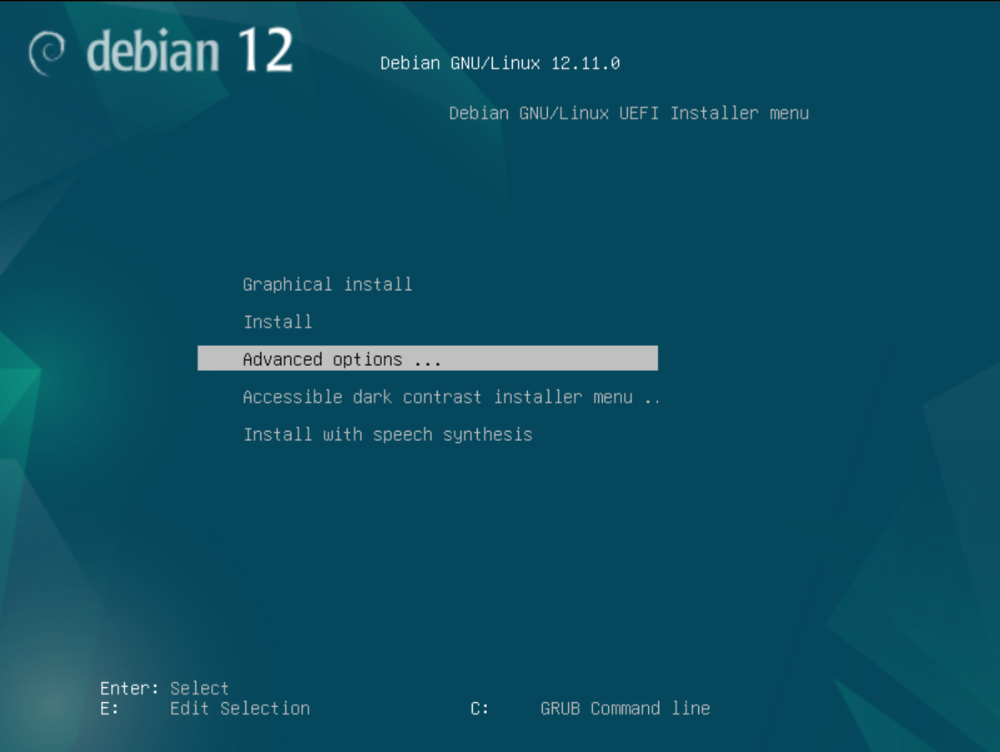
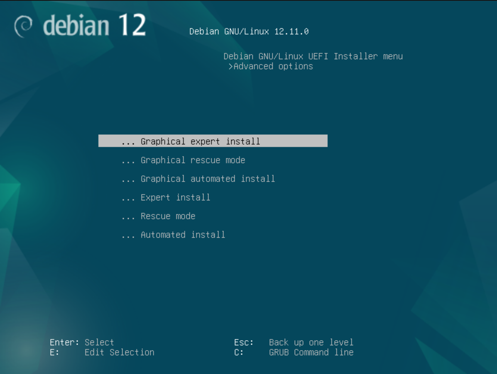
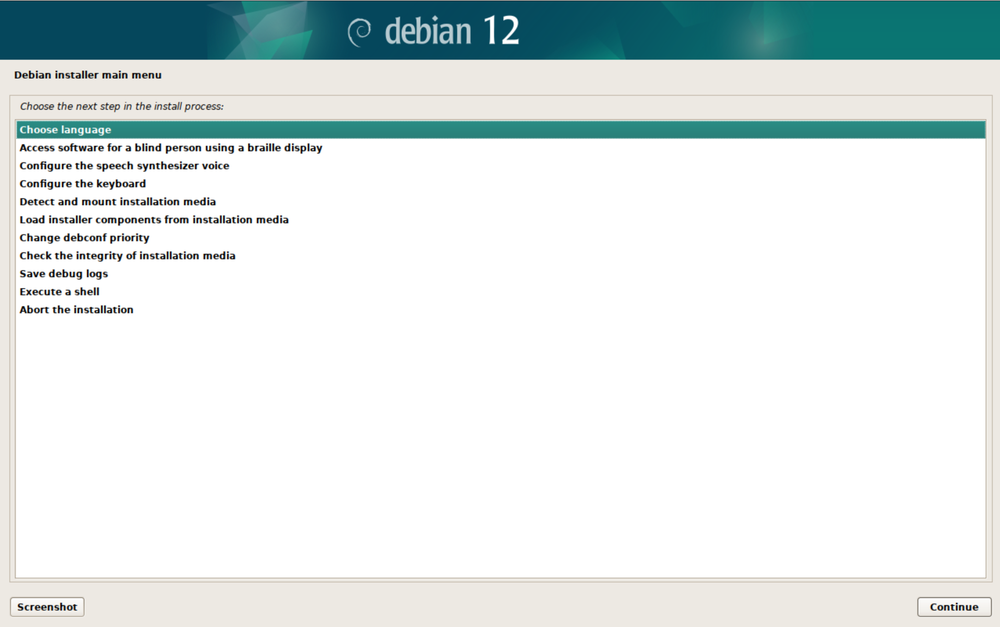
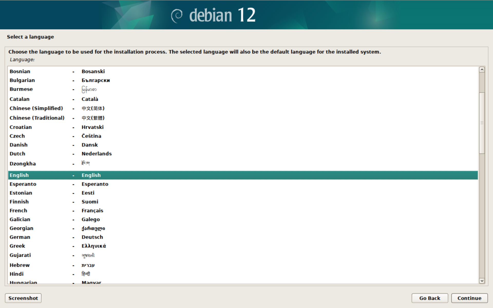
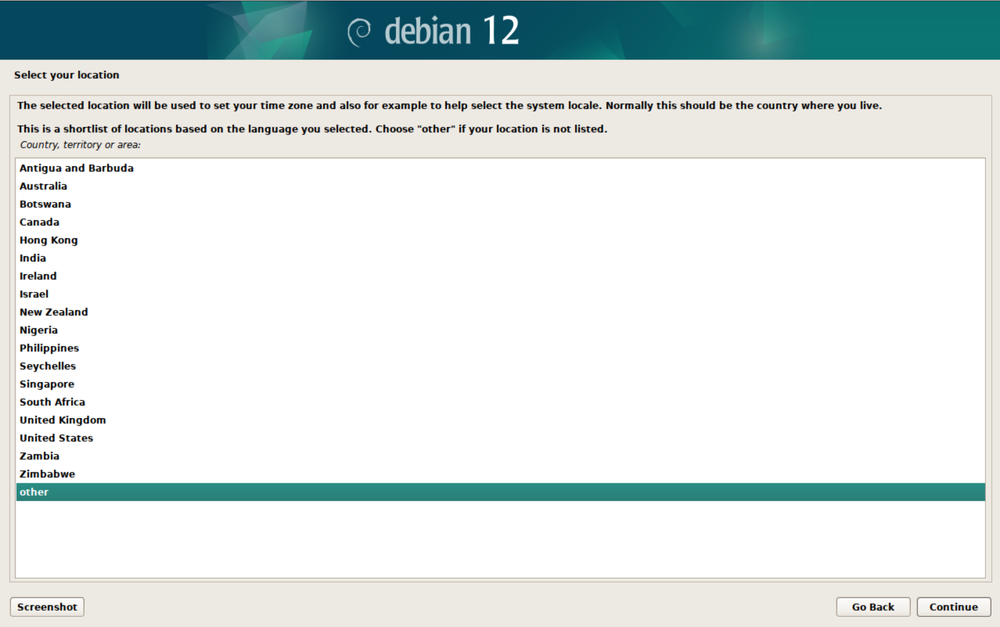
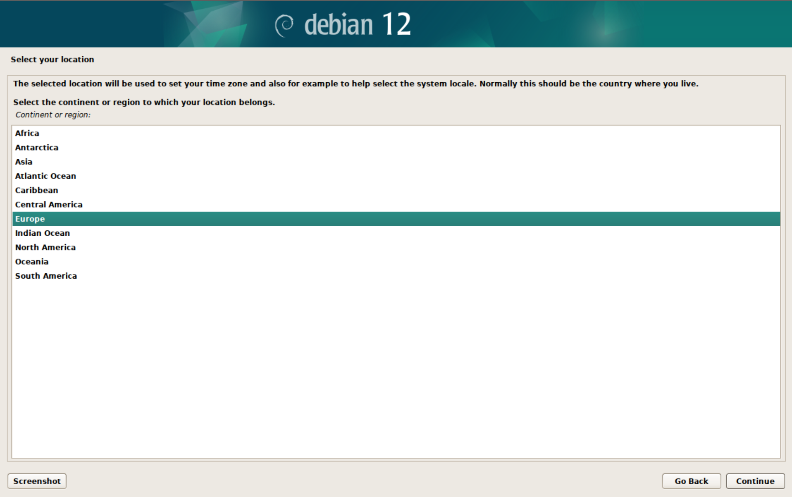
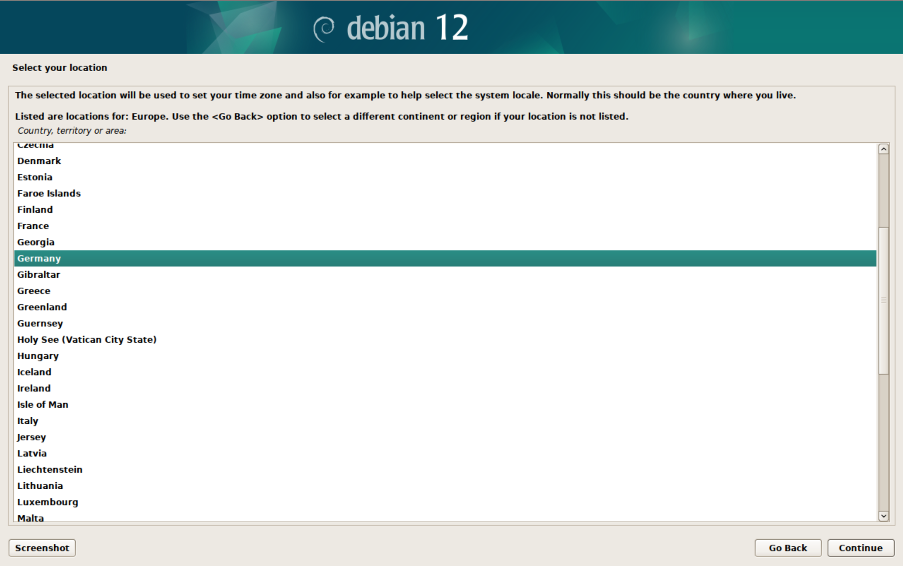
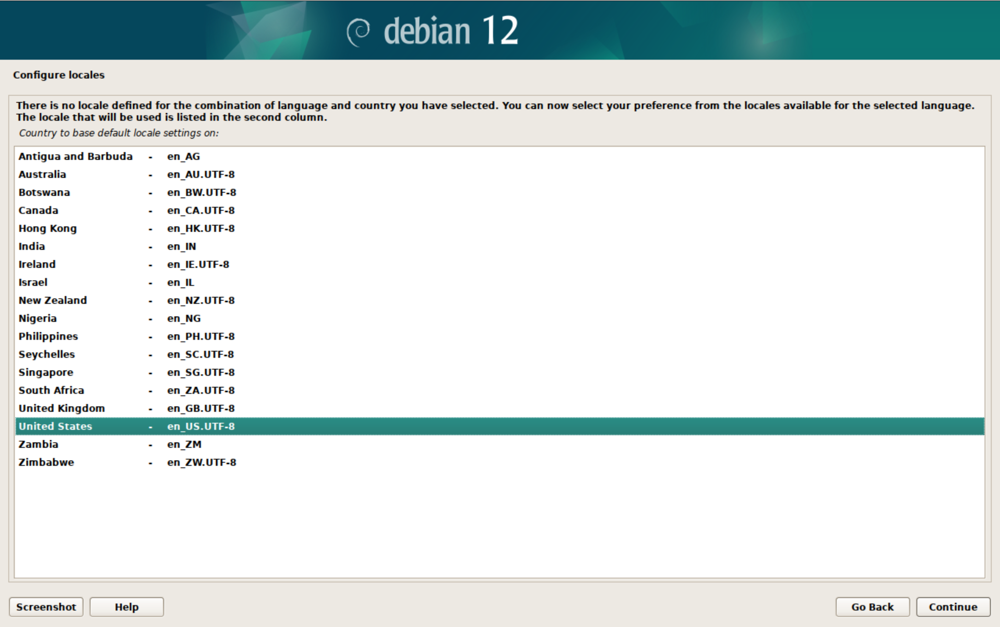
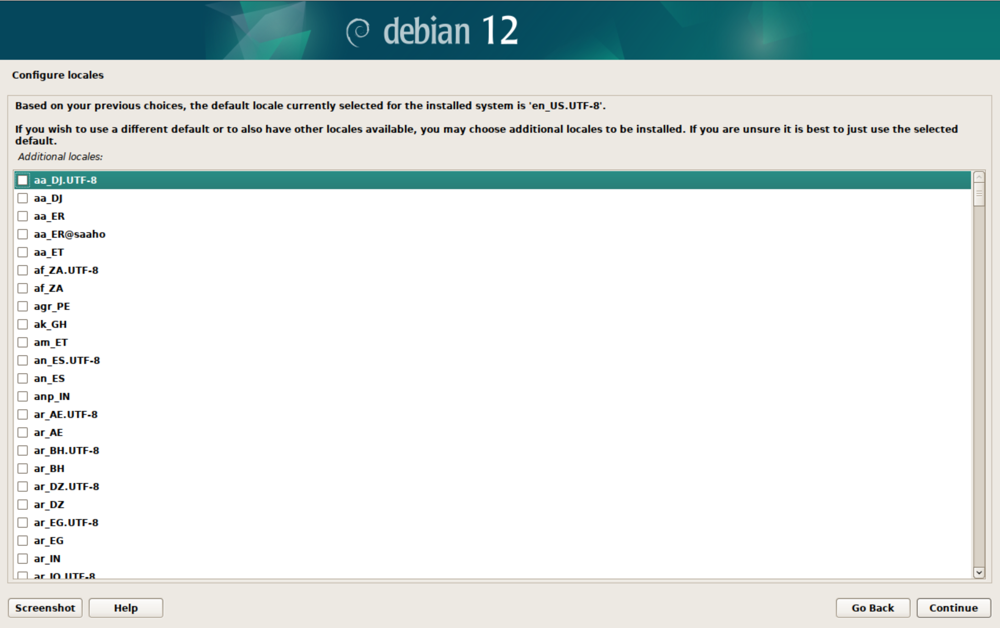
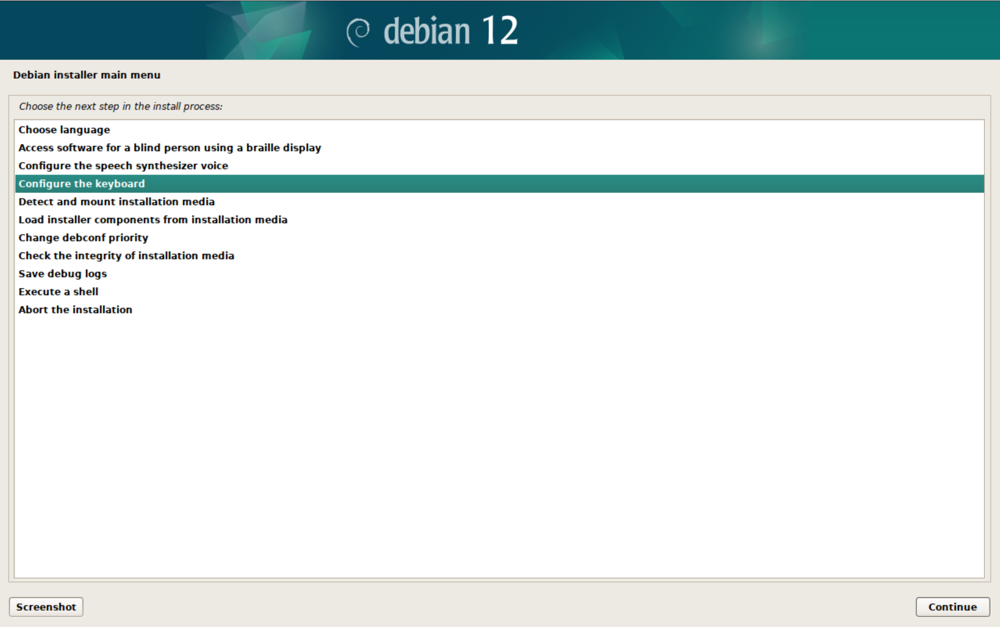

## 1. Debian 12 Installation

### 1.1 Installer (part 1)

#### 1.1.1 Choose language

#### 1.1.2 Access software for a blind person using braille display

Skip this step

#### 1.1.3 Configure the speed synthesizer voice

Skip this step

#### 1.1.3 Configure the keyboard

### 1.2 XXX

### 1.3 Installer (part 2)

